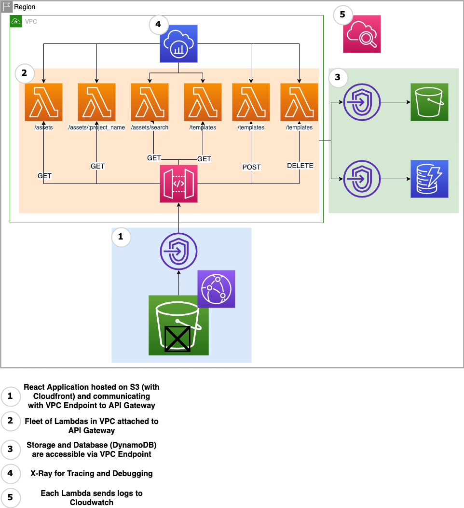

# 4dt Backend

This project uses [`projen`](https://github.com/projen/projen) which is on top of [AWS CDK](https://aws.amazon.com/cdk/) as Infrastructure to Code.



## Prerequisite

- Node v14.x
- Typescript
- [`aws configure sso`](https://docs.aws.amazon.com/cli/latest/userguide/cli-configure-sso.html)
- [pnpm](https://pnpm.io/)

For local development, please follow the instructions [here](#development).

## Structure

This project is scaffolded by using `npx projen new awscdk-app-ts` and is purely in Typescript.
We go for a [Monorepo](https://www.atlassian.com/git/tutorials/monorepos) approach, because the environment and tooling such as `typescript`, `eslint`, `jest` are identically for infrastructure and Lambda-Development.
We use [`pnpm`](https://pnpm.io/) as the Package Manager.

Furthermore, `pnpm` is supporting Monorepo development out-of-the-box.

### What does that mean?

It means there is a folder `src` (unfortunately, `projen` did not allow to rename it) for the infrastructure development whereas the `lambdas`- folder (the `packages` when talking about Monorepo) where the endpoints are created.
Within the `lambdas`- folder is also a `src` where the development in Typescript is happening.
[Learn more about Developing Lambdas in Typescript](https://omakoleg.github.io/typescript-practices/content/lambda.html)

```bash
.
├── docs
│   └── openapi
├── lambdas
│   └── src
├── infrastructure
│   ├── stacks
│   │   ├── codepipeline
│   │   └── lambda-fleet
│   └── utils
├── test
│   ├── __snapshots__
│   ├── lambdas
│   │   └── src
│   ├── stacks
│   └── utils
└── test-reports
```

## Recommendation

It is recommended to use [VS Code](https://code.visualstudio.com/) as an IDE.<br/>
We use [Codesnippets](#codesnippets) for faster development.
This project uses three VS Code extensions (see `.vscode/extensions.json`).

- [Eslint](https://marketplace.visualstudio.com/items?itemName=dbaeumer.vscode-eslint)
- [Draw.io](https://marketplace.visualstudio.com/items?itemName=hediet.vscode-drawio)
- [CodeTour](https://marketplace.visualstudio.com/items?itemName=vsls-contrib.codetour)

Follow [the CodeTour](#codetour) for a better Onboarding to this project.

### Codesnippets

Use Codesnippets for faster Development by enter e.g. `getLambda` 👇


- Model `model`
- GET Lambda `getLambda`
- POST Lambda `postLambda`

## Development

- Docker
- [Docker Compose](https://docs.docker.com/compose/)
- [awscli-local](https://github.com/localstack/awscli-local) (optional)

We use [localstack](https://github.com/localstack/localstack) for the local development. Please make sure, you have docker-compose enabled.
Open a new terminal and run.

```bash
cd lambdas
docker-compose up
```

It's recommended to have the `awscli-local` installed.

### Test

For testing, we use [Jest](https://jestjs.io/).
It is setup for the Lambda development as well as for the IaC.

```bash
pnpm test
```

Since we do Monorepo, the tests for the Lambdas within `lambdas`- folder can be called separately

```bash
cd lambdas
pnpm test
```

Otherwise, by running `pnpm test` in the root it would also trigger the `test`- script defined in the `lambdas/package.json`.

### Codesnippets

Use Codesnippets for faster Development


- GET Lambda `getLambda`
- POST Lambda `postLambda`
- Model `model`

## CodeTour

CodeTour is a VS Code Extension which allows to document the code where "traditional" code comment is too less.
After activating it, you should be able to see *CodeTour* on the left side of the bar.

In general, it would be good if you document your code when you think it needs more expression by using CodeTour.

[Learn more](https://marketplace.visualstudio.com/items?itemName=vsls-contrib.codetour)

## Troubleshooting

### Singular vs Plural (Unique Lambda Names)

Each Lambda should be unique and thus its naming.
Verify that Lambdas in the `get`- Folder have different names than in the `post`, or `put`- folder.

### Bundling was stucked

It could happen that you bundled a code which got stucked.
Simply delete `lambdas/dist`- Folder because it will get rebundled again.

### Too many assets/CFN

In order to have a clean development environment, it might be good to delete `cdk.out` which has old synthesized CFN.

### S3 already exists

Make sure an S3 with its name within account and region does not exists yet.
If necessary, delete that Bucket if you want to keep the name.
