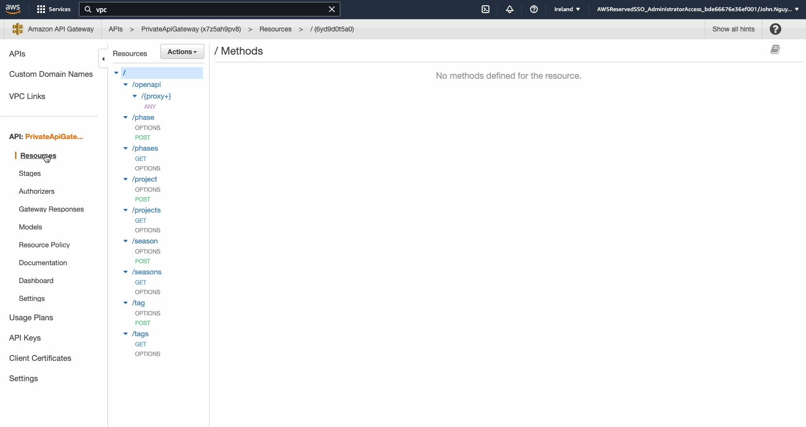

# Troubleshooting

## Context is wrong

If you cannot use `pnpm synth` or you get an Error `[Error at /FourD-LambdaFleetStack] Could not find any VPCs matching`, it might that you need to delete `cdk.context.json` and then run `pnpm synth` again.

Here we will create a new `cdk.context.json` and set new contexts.

## Parameter Store has wrong values

The context could also be corrupt because the values from the [SSM Parameter Store](https://eu-west-1.console.aws.amazon.com/systems-manager/parameters/?region=eu-west-1&tab=Table) might be false.

Please verify that `/networking/vpc/id`, `/networking/private-subnet-1/id`, and `/networking/private-subnet-2/id` are set correctly. Double check either from the Service Catalog or Cloudformation or run the command below to see the output value of the `OutputKey: VpcId` (assuming your SSO-profile name is `adidas` and AWS-Cli is installed)

For VPC:

`aws servicecatalog get-provisioned-product-outputs --provisioned-product-name vpc --profile adidas --region eu-west-1`

For Private-Subnet-1:

`aws servicecatalog get-provisioned-product-outputs --provisioned-product-name private-subnet-1 --profile adidas --region eu-west-1`

For Private-Subnet-2:

`aws servicecatalog get-provisioned-product-outputs --provisioned-product-name private-subnet-2 --profile adidas --region eu-west-1`

## Singular vs Plural (Unique Lambda Names)

Each Lambda should be unique and thus its naming.
Verify that Lambdas in the `get`- Folder have different names than in the `post`, or `put`- folder.

## Bundling was stucked

It could happen that you bundled a code which got stucked.
Simply delete `lambdas/dist`- Folder because it will get rebundled again.

## Too many assets/CFN

In order to have a clean development environment, it might be good to delete `cdk.out` which has old synthesized CFN.

## S3 already exists

Make sure an S3 with its name within account and region does not exists yet.
If necessary, delete that Bucket if you want to keep the name.

## All arguments to Vpc.fromLookup() must be concrete (no Tokens)

For some reasons, it could happen that you run into

```bash
throw new Error('All arguments to Vpc.fromLookup() must be concrete (no Tokens)');
            ^
Error: All arguments to Vpc.fromLookup() must be concrete (no Tokens)
    at Function.fromLookup (/Users/jolo/Development/4dt-api-node/node_modules/.pnpm/@aws-cdk+aws-ec2@1.136.0/node_modules/@aws-cdk/aws-ec2/lib/vpc.ts:637:13)
    at LambdaFleetStack.getVpc (/Users/jolo/Development/4dt-api-node/infrastructure/stacks/lambda-fleet/Stack.ts:138:16)
```

It is because there was put a wrong `context` in the `cdk.json`. If that happens, delete `cdk.context.json` and run again `pnpm synth` (Make sure you set the AWS credentials in the environment variables).

## Deployment did not happen

Sometime you run `pnpm deploy` but it outputs `✅  FourD-LambdaFleetStack (no changes)` even though you changed.<br/>
It helps to synth (`pnpm synth`) and then run `pnpm deploy` again.

## Local Development

### Deployment got stucked

It can happen that your deployment got stucked, most at `DynamoDbLocal` (see in your terminal). <br/>
If that happens, you have to stop the deployment process (Ctrl + c) and the stop `docker-compose` (`docker-compose down` when `-d`- flag is turned on).<br/>
Then you need to bootstrap cdklocal again (`pnpm local:bootstrap && pnpm local:deploy`).

### Swagger UI doesn't work

Make sure you have the correct `rest-api-id` in the URL.
It might be that you deployed the Stack but still have an old URL.

### CORS

It could happen that CORS appears for some reasons. In the CDK code, the `defaultCorsPreflightOptions` is given (see `LambdaFleet.ts` and `PrivateApiGateway.ts`) but AWS could not deploy or set it correctly.
If the `pnpm deploy` doesn't work, go to the AWS Console [https://eu-west-1.console.aws.amazon.com/apigateway/](https://eu-west-1.console.aws.amazon.com/apigateway/) (Note: this is for `eu-west-1`) -> Resource left -> click on each Resource -> go to Actions -> Enable CORS -> click bottom left the blue button "Enable CORS and replace existing CORS Header" -> Click "Yes replace existing header".
.
